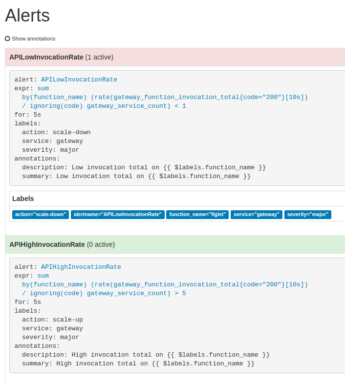
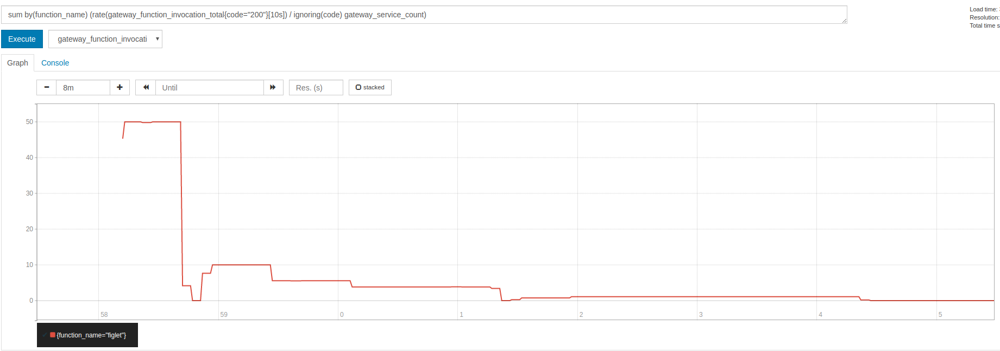
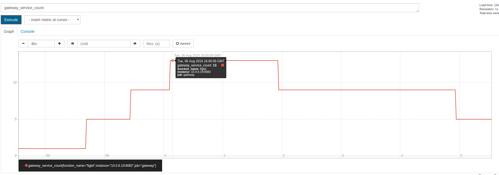

# FaaS-autoscaler: An autoscaling controller for OpenFaaS

OpenFaaS&reg; is a well known FaaS framework with great features.
However as discussed in issue [#1271](https://github.com/openfaas/faas/issues/1271), the default scaling policy may have
some problems. So we created this project to provide another controller for autoscaling feature.

## How it works
OpenFaaS&reg; uses promethues to monitor function work load, alertmanager will send alert to gateway to scale up function
when work load is high. See [of-overview.png:](https://github.com/openfaas/faas/blob/master/docs/of-overview.png)
  

faas-autoscaler has two endpoints `/system/scale-up` and `/system/scale-down`, we need prometheus to monitor the function work load,
when load is high, alertmanager calls `/system/scale-up` to create more replicas, and when load is low, calls `/system/scale-down`.

Each time `scale-up` or `scale-down` is called, function replicas will increase/decrease by a `deltaReplica`, until replica exceeds `[minReplica, maxReplica]`, the calculation is :
```$xslt
deltaReplica = maxReplica * scaleFactor
```

In this project we use the following rules:

```$xslt
alert: APIHighInvocationRate
expr: sum by(function_name) (rate(gateway_function_invocation_total{code="200"}[10s]) / ignoring(code) gateway_service_count) > 5
for: 5s
labels:
  service: gateway
  severity: major
  action: scale-up
annotations:
  description: High invocation total on {{ $labels.function_name }}
  summary: High invocation total on {{ $labels.function_name }}
```
```$xslt
alert: APILowInvocationRate
expr: sum by(function_name) (rate(gateway_function_invocation_total{code="200"}[10s]) / ignoring(code) gateway_service_count) < 1
for: 5s
labels:
  service: gateway
  severity: major
  action: scale-down
annotations:
  description: Low invocation total on {{ $labels.function_name }}
  summary: Low invocation total on {{ $labels.function_name }}
```

It means when QPS for each replica is higher than 5, we scale up; and when  QPS is lower than 1, we scale down

## Deploy
First we need to first build faas-autoscaler image
```$xslt
make build
```

then we need to deploy full faas stack
```$xslt
make dploy
```

## Test Drive
open `http://127.0.0.1:8080` in your browser, login gateway with user `admin` and password `admin`

deploy function `figlet` or other if you like.

call your function with an automation tool like [hey](https://github.com/rakyll/hey)

```$xslt
hey -q 60 -c 1 -disable-keepalive -m POST -d a -z 2m http://127.0.0.1:8080/function/figlet
```
this command calls figlet function with QPS = 60, `APIHighInvocationRate` fires, then we will find replicas becomes 13 
(initial replica is 1, deltaReplica is 4 = 20*20%, scale up 3 times)

## Demo
In this demo, we use default faas-autoscaler prometheus rules


We first call figlet function with QPS = 60, then decrease to 10, and finally 0.

We can see qps increased first, then after scaling up, qps dropped quickly


We can tell replicas decreased as qps dropped from 60 to 10


##autoscale

