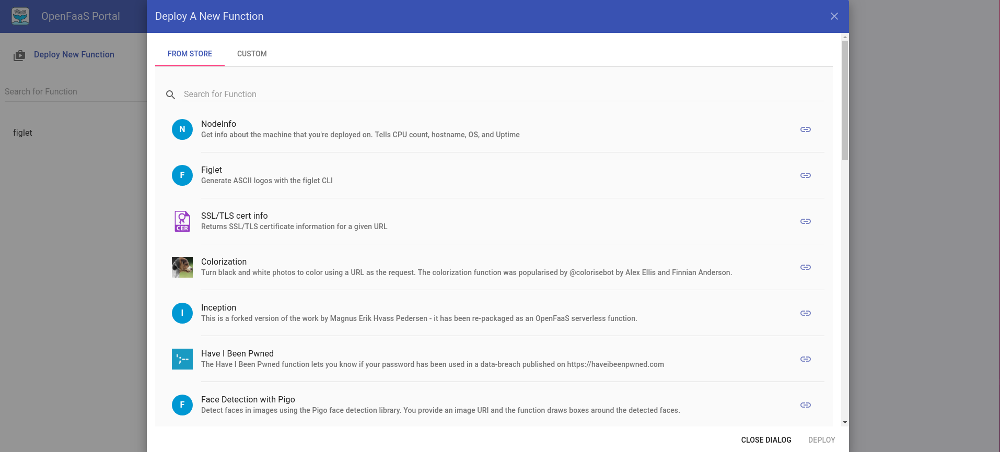
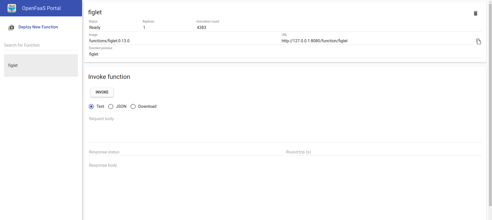
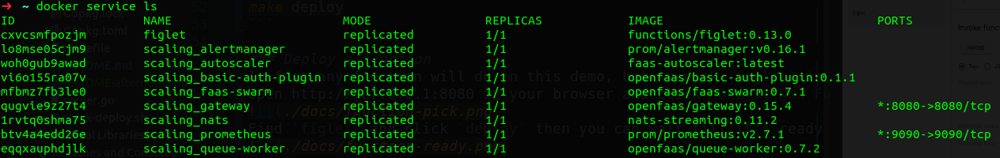
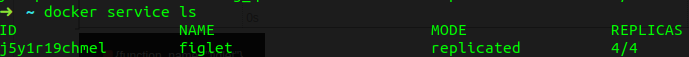
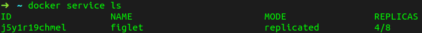

# FaaS-autoscaler: An autoscaling controller for OpenFaaS

OpenFaaS&reg; is a well known FaaS framework with great features.
However as discussed in issue [#1271](https://github.com/openfaas/faas/issues/1271), the default scaling policy may have
some problems. Inspired by kubernetes HPAv2 (horizontal-pod-autoscale), we created this project to bring autoscaling for openfaas in docker swarm.

##How it works
HPA will query resource utilization against metrics defined in HPA definition periodically. 
In each period, HPA obtains metrics and calculate the desired pod replica number, then HPA will update the deployment replicas according to the calculation.
```text
desiredReplicas = ceil[currentReplicas * ( currentMetricValue / desiredMetricValue )]
``` 
We implemented faas-autoscaler similarly. We use prometheus to tell us current metrics periodically, by setting up this alert rule:
```yaml
- alert: APIInvoke
  expr: rate(gateway_function_invocation_total[10s]) / ignoring(code) gateway_service_count >= 0
  for: 5s
  labels:
    service: gateway
    severity: major
    action: auto-scale
    target: 2
    value: "{{ $value }}"
  annotations:
    description: Function invoke on {{ $labels.function_name }}
    summary: Function invoke on {{ $labels.function_name }}
```
When functions are called, alertmanager will send alert to faas-autoscaler's `/system/auto-scale` endpoint.
faas-autoscaler will take label `target` as desired metric, and `value` as current metric, desired replicas are calculated by:
```text
desiredReplicas = ceil[currentReplicas * ( value / target )]
```
The above prometheus rule will only scale functions by RPS (request-per-second), each function replica will only handle approximately 2 requests in concurrent.
But because faas-autoscaler only cares about `target` and `value` label, so you can easily change the alert rule to make it scale by cpu/mem usage etc.

## Demo
In this demo we will show you how replicas are changed when RPS is changed.
We will invoke function with RPS=7, and we will see the replicas are changed to 4, because `target` is set to 2.
Then we will increase RPS to 15, and replicas will increase to 8.
Finally we will stop calling the function, and replicas will drop to 1. 
For this purpose we need to deploy a whole new openfaas stack in your local for this demo, please make sure your port 8080 and 9090 is not used.

### Build docker image
In this step we first prepare faas-autoscaler image
```bash
make build
```

### Deploy stack
We deploy the openfaas stack and faas-autoscaler, we also changed the admin password to `admin` so we can later use openfaas-ui easily.
```bash
make deploy
```

### Deploy a function
In fact any function will do in this demo, but we pick `figlet` in this demo.
Open http://127.0.0.1:8080 in your browser and click `Deploy New Function` button.

Find `figlet` and click `deploy` then you can wait till it's ready

you can check your environment by
```bash
docker service ls
```

### Invoke your function
We need an automation tool for function invoke. In this demo we choose [hey](https://github.com/rakyll/hey).

First we invoke figlet with RPS=7
```bash
hey -q 7 -c 1 -disable-keepalive -m POST -d a -z 10m http://127.0.0.1:8080/function/figlet
```
then figlet replicas becomes 4


Then you can increase the RPS
```bash
hey -q 15 -c 1 -disable-keepalive -m POST -d a -z 10m http://127.0.0.1:8080/function/figlet
```
and now replicas becomes 8


Finally we stop the test, and we will see figlet scaled to 1
